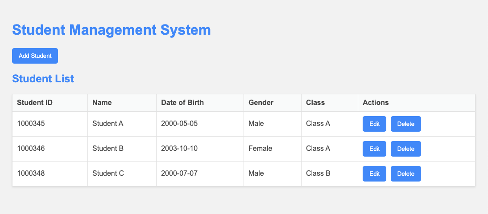
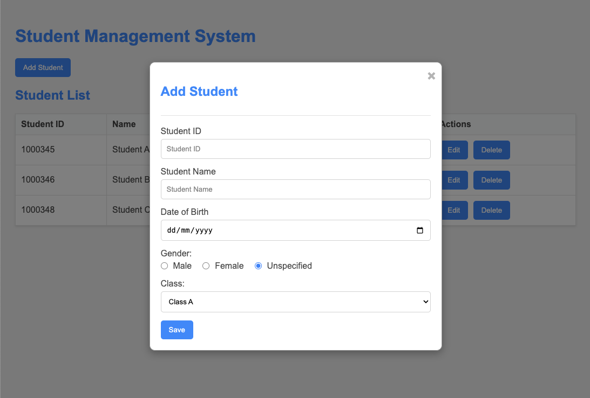
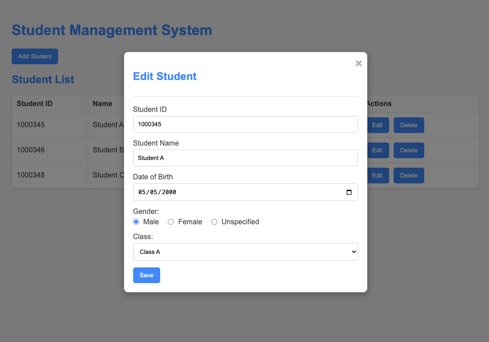

# Student Management System

## Giới thiệu
Ứng dụng Quản lý Sinh viên là một công cụ đơn giản và dễ sử dụng để quản lý thông tin sinh viên. Ứng dụng này được xây dựng bằng HTML, CSS và JavaScript, sử dụng `localStorage` để lưu trữ dữ liệu sinh viên trên trình duyệt.

## Kiến thức sử dụng
Ứng dụng này sử dụng các kiến thức và công nghệ sau:
- **HTML**: Để xây dựng cấu trúc trang web.
- **CSS**: Để thiết kế giao diện người dùng và định dạng các thành phần trên trang.
- **JavaScript**: Để xử lý logic ứng dụng, bao gồm thêm, chỉnh sửa, xóa và lưu trữ dữ liệu sinh viên.
- **localStorage**: Để lưu trữ dữ liệu sinh viên trên trình duyệt, giúp dữ liệu không bị mất khi trang được tải lại.

## Chức năng của ứng dụng
Ứng dụng Quản lý Sinh viên cung cấp các chức năng chính sau:
1. **Thêm sinh viên**: Cho phép thêm mới một sinh viên với các thông tin như Mã Sinh Viên, Tên, Ngày Sinh, Giới Tính và Lớp.
2. **Chỉnh sửa sinh viên**: Cho phép chỉnh sửa thông tin của một sinh viên đã tồn tại. Mã Sinh Viên không thể thay đổi khi chỉnh sửa.
3. **Xóa sinh viên**: Cho phép xóa một sinh viên khỏi danh sách. Trước khi xóa, ứng dụng sẽ hiển thị một cửa sổ xác nhận để người dùng xác nhận hành động này.
4. **Lưu trữ dữ liệu**: Tự động lưu trữ dữ liệu sinh viên vào `localStorage`, đảm bảo dữ liệu không bị mất khi trang được tải lại.
5. **Hiển thị danh sách sinh viên**: Hiển thị danh sách các sinh viên đã được thêm vào ứng dụng.

## Các lưu ý
- **localStorage**: Dữ liệu được lưu trữ trong `localStorage` của trình duyệt, nghĩa là dữ liệu sẽ tồn tại ngay cả khi bạn đóng và mở lại trình duyệt. Tuy nhiên, dữ liệu sẽ bị mất nếu bạn xóa bộ nhớ cache của trình duyệt hoặc chuyển sang một trình duyệt khác.
- **Không thay đổi Mã Sinh Viên khi chỉnh sửa**: Khi chỉnh sửa thông tin sinh viên, bạn không thể thay đổi Mã Sinh Viên của sinh viên đó.
- **Kiểm tra trùng lặp Mã Sinh Viên**: Khi thêm sinh viên mới, ứng dụng sẽ kiểm tra và thông báo nếu Mã Sinh Viên đã tồn tại trong danh sách.

## Cách sử dụng
1. **Thêm sinh viên**:
    - Nhấn nút "Add Student".
    - Nhập thông tin sinh viên vào các trường trong cửa sổ bật lên.
    - Nhấn "Save" để lưu thông tin sinh viên.
    - 

2. **Chỉnh sửa sinh viên**:
    - Nhấn nút "Edit" bên cạnh sinh viên cần chỉnh sửa.
    - Thay đổi các thông tin cần thiết trong cửa sổ bật lên (trừ Mã Sinh Viên).
    - Nhấn "Save" để lưu các thay đổi.
    - 

3. **Xóa sinh viên**:
    - Nhấn nút "Delete" bên cạnh sinh viên cần xóa.
    - Xác nhận hành động xóa trong cửa sổ bật lên.

## Cài đặt và Chạy
1. Tải mã nguồn về máy tính của bạn.
2. Mở tệp `index.html` trong trình duyệt.
3. Trang chủ sẽ hiển thị như sau:
    - 
