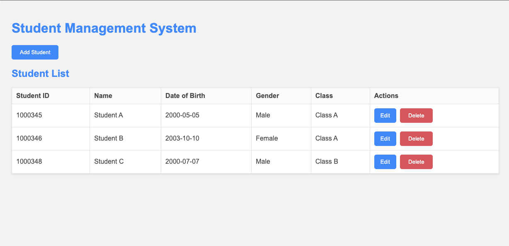
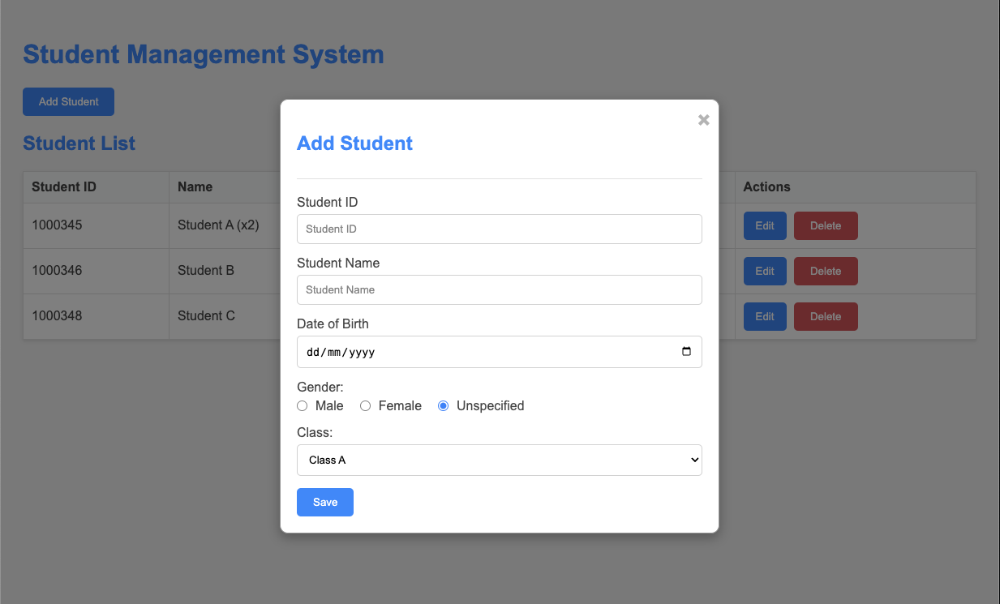
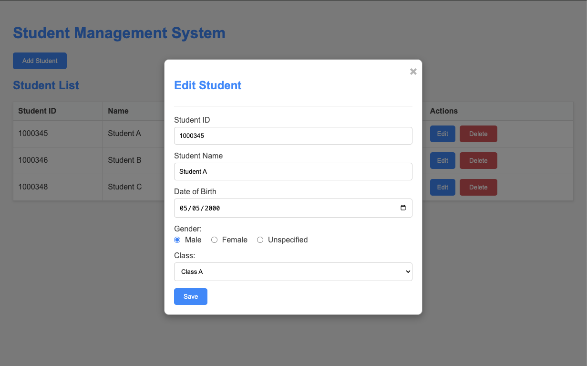
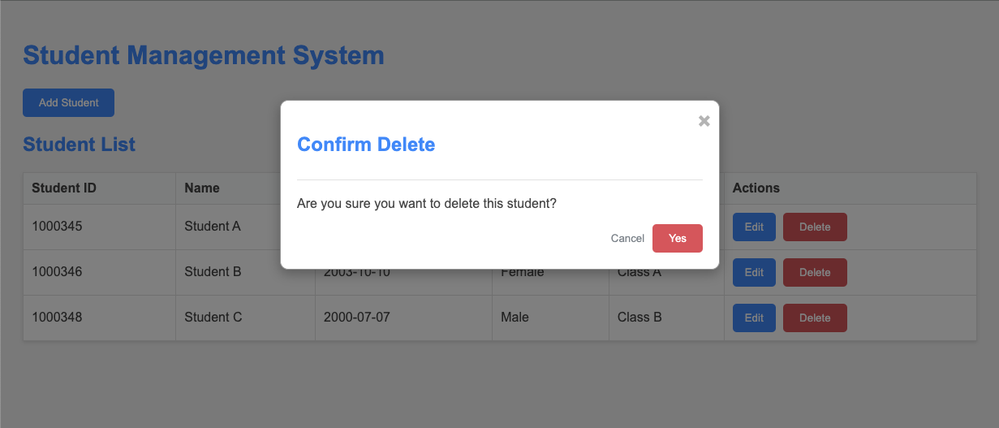

# Student Management System



## I. Giới thiệu
Đây là bài thực hành xây dựng ứng dụng Quản lý Sinh viên là một công cụ đơn giản và dễ sử dụng để quản lý thông tin sinh viên. Ứng dụng này được xây dựng bằng HTML, CSS và JavaScript, sử dụng `localStorage` để lưu trữ dữ liệu sinh viên trên trình duyệt.

Bài thực hành này mục đích của là để sinh viên thực hành các phần kiến thức quan trọng sau của Javascript:

1) Cài đặt JavaScript
2) Biến và kiểu dữ liệu
3) Toán tử và biểu thức
4) Câu lệnh điều kiện
5) Vòng lặp
6) Hàm
7) Mảng và đối tượng
8) DOM (Document Object Model)
9) Sự kiện (Events)
10) Web API

## II. Kiến thức sử dụng

### 1. Cài đặt JavaScript
JavaScript là một ngôn ngữ lập trình phổ biến được sử dụng chủ yếu cho lập trình web. Nó cho phép các nhà phát triển tạo ra các trang web tương tác và động bằng cách thao tác với các phần tử HTML và CSS. JavaScript được hỗ trợ rộng rãi bởi tất cả các trình duyệt web hiện đại và có thể được nhúng trực tiếp vào các trang HTML hoặc tách biệt qua các tệp `.js`.


#### Cách thêm Javasript vào trang Web?

Có thể thêm JavaScript trực tiếp vào trong tệp HTML bằng cách sử dụng thẻ `<script>` như dưới đây

```html
<!DOCTYPE html>
<html lang="en">
<head>
    <meta charset="UTF-8">
    <title>Inline JavaScript Example</title>
</head>
<body>
    <h1>Hello, world!</h1>
    <script>
        // JavaScript nội tuyến
        console.log("This is an inline JavaScript example.");
    </script>
</body>
</html>
```

cũng có thể thêm JavaScript bằng cách sử dụng một tệp JavaScript ngoài. Để làm điều này, bạn cần tạo một tệp .js và liên kết nó trong tệp HTML như sau

```html
<!DOCTYPE html>
<html lang="en">
<head>
    <meta charset="UTF-8">
    <title>External JavaScript Example</title>
</head>
<body>
    <h1>Hello, world!</h1>
    <script src="script.js"></script>
</body>
</html>
```

#### Sự khác biệt khi thêm Scripts và <head> hoặc <body> của tệp HTML?

- Khi thêm JavaScript vào phần `<head>`, mã JavaScript sẽ được thực thi trước khi toàn bộ nội dung của trang được tải. Điều này có thể hữu ích cho các thiết lập ban đầu hoặc khai báo biến toàn cục.
- Thêm JavaScript vào cuối phần `<body>` đảm bảo rằng mã JavaScript sẽ được thực thi sau khi toàn bộ nội dung của trang đã được tải. Đây là cách phổ biến để thêm JavaScript, đặc biệt khi mã JavaScript cần tương tác với các phần tử DOM.

### 2. Biến và kiểu dữ liệu
Biến trong JavaScript là các nơi lưu trữ dữ liệu có thể thay đổi trong suốt thời gian thực thi chương trình. JavaScript hỗ trợ nhiều kiểu dữ liệu khác nhau như số, chuỗi, boolean, null, undefined, và đối tượng. Việc khai báo biến có thể được thực hiện bằng các từ khóa var, let, và const.

- **Biến**:
  - Ví dụ: Khai báo các biến để lưu trữ thông tin sinh viên như `studentId`, `name`, `dob`, `gender`, `className`.
- **Kiểu dữ liệu**:
  - Ví dụ: Sử dụng kiểu chuỗi để lưu trữ tên sinh viên, kiểu số để lưu trữ ngày tháng năm sinh.

```js
// Khai báo biến để lưu trữ thông tin sinh viên
let studentId = '12345';
const name = 'John Doe';
```

```js
// Ví dụ về các kiểu dữ liệu cơ bản
let age = 20; // Số
let isActive = true; // Boolean
let studentName = 'Jane Smith'; // Chuỗi
let student = { id: '12345', name: 'Jane Smith' }; // Đối tượng
```

### 3. Toán tử và biểu thức

Toán tử trong JavaScript là các ký hiệu đặc biệt dùng để thực hiện các phép toán trên các toán hạng. Các toán tử bao gồm toán tử số học, logic, và so sánh. Biểu thức là sự kết hợp giữa các toán tử và toán hạng để tạo ra một giá trị mới.

- **Toán tử số học, logic, so sánh**:
  - Ví dụ: Sử dụng toán tử so sánh để kiểm tra xem `studentId` có trùng lặp hay không.
- **Biểu thức và câu lệnh**: Cách viết các biểu thức và câu lệnh đơn giản trong JavaScript.

```js
// Kiểm tra trùng lặp studentId
if (studentId === '12345') {
  console.log('Student ID already exists!');
}
```


```js
let result = (age > 18) ? 'Adult' : 'Minor'; // Biểu thức điều kiện
```

### 4. Câu lệnh điều kiện

Câu lệnh điều kiện trong JavaScript cho phép thực thi các đoạn mã khác nhau dựa trên điều kiện đúng hay sai. Các câu lệnh điều kiện bao gồm if, else if, else, và switch, cho phép kiểm tra nhiều điều kiện và thực hiện các hành động tương ứng.

- Ví dụ: Sử dụng câu lệnh `if` để kiểm tra xem `studentId` có tồn tại trong danh sách không trước khi thêm sinh viên.

```js
if (age < 13) {
  console.log('Child');
} else if (age < 20) {
  console.log('Teenager');
} else {
  console.log('Adult');
}
```

```js
switch (gender) {
  case 'Male':
    console.log('Gender: Male');
    break;
  case 'Female':
    console.log('Gender: Female');
    break;
  default:
    console.log('Gender: Unspecified');
}
```

### 5. Vòng lặp

Vòng lặp trong JavaScript cho phép thực thi một khối mã nhiều lần cho đến khi một điều kiện nhất định được thỏa mãn. Các vòng lặp phổ biến bao gồm for, while, và do-while. Vòng lặp cũng có thể sử dụng các câu lệnh break và continue để điều khiển luồng thực thi.

- Ví dụ: Sử dụng vòng lặp `for` để duyệt qua các hàng trong bảng sinh viên.

```js
// Vòng lặp for để duyệt qua các sinh viên
for (let i = 0; i < students.length; i++) {
  console.log(students[i].name);
}
```

```js
for (let i = 0; i < students.length; i++) {
  if (students[i].id === '12345') {
    continue; // Bỏ qua sinh viên có id '12345'
  }
  console.log(students[i].name);
}
```

### 6. Hàm

Hàm trong JavaScript là các khối mã được đặt tên và có thể được gọi lại nhiều lần ở bất kỳ đâu trong chương trình. Hàm có thể nhận tham số và trả về giá trị. Chúng giúp mã dễ đọc hơn và tái sử dụng mã.

- Ví dụ: Tạo các hàm như `addStudent`, `updateStudent`, `deleteStudent` để thực hiện các thao tác tương ứng.

```js
for (let i = 0; i < students.length; i++) {
  if (students[i].id === '12345') {
    continue; // Bỏ qua sinh viên có id '12345'
  }
  console.log(students[i].name);
}
```

```js
function calculateAge(dob) {
  const birthDate = new Date(dob);
  const ageDifMs = Date.now() - birthDate.getTime();
  const ageDate = new Date(ageDifMs);
  return Math.abs(ageDate.getUTCFullYear() - 1970);
}
// Gọi hàm và sử dụng giá trị trả về
let age = calculateAge('2000-01-01');
```

### 7. Mảng và đối tượng

Mảng trong JavaScript là các danh sách có thứ tự của các phần tử, có thể là bất kỳ kiểu dữ liệu nào. Đối tượng là các thực thể lưu trữ các cặp key-value, cho phép lưu trữ các thuộc tính và phương thức liên quan đến một thực thể cụ thể.

- **Mảng**:
  - Ví dụ: Lưu trữ danh sách sinh viên trong một mảng và sử dụng `localStorage` để lưu trữ mảng này.
- **Đối tượng**:
  - Ví dụ: Lưu trữ thông tin sinh viên dưới dạng đối tượng với các thuộc tính như `studentId`, `name`, `dob`, `gender`, `className`.

```js
let students = [
  { id: '12345', name: 'John Doe', dob: '2000-01-01', gender: 'Male', className: 'Class A' },
  { id: '67890', name: 'Jane Smith', dob: '1999-02-02', gender: 'Female', className: 'Class B' }
];
console.log(students[0].name); // Truy cập phần tử đầu tiên của mảng
```

```js
let student = {
  id: '12345',
  name: 'John Doe',
  dob: '2000-01-01',
  gender: 'Male',
  className: 'Class A'
};
console.log(student.name); // Truy cập thuộc tính name của đối tượng
```

### 8. DOM (Document Object Model)

DOM cho phép JavaScript truy cập và thay đổi nội dung, cấu trúc, và kiểu của trang web. Thông qua DOM, các nhà phát triển có thể thao tác các phần tử HTML, thêm hoặc xóa các phần tử, và thay đổi các thuộc tính của chúng.

- **Truy cập và thao tác DOM**: Cách truy cập và thay đổi các phần tử HTML bằng JavaScript.
  - Ví dụ: Sử dụng `document.getElementById` và `document.querySelector` để truy cập và thay đổi các phần tử trong modal thêm và chỉnh sửa sinh viên.

```js
// Truy cập phần tử HTML
let studentTable = document.getElementById('studentTable');
// Thay đổi nội dung của phần tử
studentTable.innerHTML = '<tr><td>12345</td><td>John Doe</td></tr>';
```

### 9. Sự kiện (Events)

Sự kiện trong JavaScript là các hành động hoặc xảy ra do tương tác của người dùng hoặc trình duyệt, như nhấp chuột, gửi biểu mẫu, hoặc tải trang. Xử lý sự kiện cho phép các nhà phát triển thực hiện các hành động cụ thể khi sự kiện xảy ra, tạo ra các trang web tương tác và phản hồi.

- **Xử lý sự kiện**:
  - Ví dụ: Xử lý sự kiện `click` khi người dùng nhấn nút "Add Student", "Edit", "Delete".
- **Các loại sự kiện phổ biến**: Click, submit, change, mouseover, keypress, etc.

```js
// Thêm sự kiện click cho nút "Add Student"
document.getElementById('addStudentBtn').addEventListener('click', function() {
  openModal('add');
});
```

### 10. Web API

Web API cung cấp các giao diện để tương tác với các chức năng của trình duyệt hoặc các dịch vụ web bên ngoài. Các Web API phổ biến bao gồm Fetch API để thực hiện các yêu cầu HTTP, Local Storage API để lưu trữ dữ liệu phía client, và Geolocation API để lấy thông tin vị trí địa lý của thiết bị. Các API này mở rộng khả năng của JavaScript trong việc tương tác với môi trường web.

- Ví dụ về Web API:
  - **Fetch API:** Sử dụng để thực hiện các yêu cầu HTTP và nhận phản hồi từ máy chủ.
  - **Local Storage API:** Sử dụng để lưu trữ dữ liệu phía client một cách bền vững.
  - **Geolocation API:** Sử dụng để lấy thông tin vị trí địa lý của thiết bị.

Ví dụ về Fetch API:
```js
// Sử dụng Fetch API để lấy dữ liệu từ một URL
fetch('https://api.example.com/data')
  .then(response => response.json())
  .then(data => console.log(data))
  .catch(error => console.error('Error:', error));

```

Ví dụ về Local Storage API:
```js
// Lưu trữ dữ liệu vào localStorage
localStorage.setItem('username', 'JohnDoe');

// Lấy dữ liệu từ localStorage
let username = localStorage.getItem('username');
console.log(username); // In ra "JohnDoe"

// Xóa dữ liệu từ localStorage
localStorage.removeItem('username');

// Xóa tất cả dữ liệu từ localStorage
localStorage.clear();
```

Ví dụ về Geolocation API:
```js
// Lấy vị trí địa lý hiện tại của thiết bị
if (navigator.geolocation) {
  navigator.geolocation.getCurrentPosition(
    position => {
      console.log('Latitude:', position.coords.latitude);
      console.log('Longitude:', position.coords.longitude);
    },
    error => console.error('Error:', error)
  );
} else {
  console.log('Geolocation is not supported by this browser.');
}
```

## III. Chức năng của ứng dụng
Ứng dụng Quản lý Sinh viên cung cấp các chức năng chính sau:
1. **Thêm sinh viên**: Cho phép thêm mới một sinh viên với các thông tin như Mã Sinh Viên, Tên, Ngày Sinh, Giới Tính và Lớp.
    - 
2. **Chỉnh sửa sinh viên**: Cho phép chỉnh sửa thông tin của một sinh viên đã tồn tại. Mã Sinh Viên không thể thay đổi khi chỉnh sửa.
    - 
3. **Xóa sinh viên**: Cho phép xóa một sinh viên khỏi danh sách. Trước khi xóa, ứng dụng sẽ hiển thị một cửa sổ xác nhận để người dùng xác nhận hành động này.
    - 
4. **Lưu trữ dữ liệu**: Tự động lưu trữ dữ liệu sinh viên vào `localStorage`, đảm bảo dữ liệu không bị mất khi trang được tải lại.
5. **Hiển thị danh sách sinh viên**: Hiển thị danh sách các sinh viên đã được thêm vào ứng dụng.
    - 

## IV. Các lưu ý
- **localStorage**: Dữ liệu được lưu trữ trong `localStorage` của trình duyệt, nghĩa là dữ liệu sẽ tồn tại ngay cả khi bạn đóng và mở lại trình duyệt. Tuy nhiên, dữ liệu sẽ bị mất nếu bạn xóa bộ nhớ cache của trình duyệt hoặc chuyển sang một trình duyệt khác.
- **Không thay đổi Mã Sinh Viên khi chỉnh sửa**: Khi chỉnh sửa thông tin sinh viên, bạn không thể thay đổi Mã Sinh Viên của sinh viên đó.
- **Kiểm tra trùng lặp Mã Sinh Viên**: Khi thêm sinh viên mới, ứng dụng sẽ kiểm tra và thông báo nếu Mã Sinh Viên đã tồn tại trong danh sách.

## V. Cách sử dụng
1. **Thêm sinh viên**:
    - Nhấn nút "Add Student".
    - Nhập thông tin sinh viên vào các trường trong cửa sổ bật lên.
    - Nhấn "Save" để lưu thông tin sinh viên.

2. **Chỉnh sửa sinh viên**:
    - Nhấn nút "Edit" bên cạnh sinh viên cần chỉnh sửa.
    - Thay đổi các thông tin cần thiết trong cửa sổ bật lên (trừ Mã Sinh Viên).
    - Nhấn "Save" để lưu các thay đổi.

3. **Xóa sinh viên**:
    - Nhấn nút "Delete" bên cạnh sinh viên cần xóa.
    - Xác nhận hành động xóa trong cửa sổ bật lên.

## Cài đặt và Chạy
1. Tải mã nguồn về máy tính của bạn.
2. Mở tệp `index.html` trong trình duyệt.
