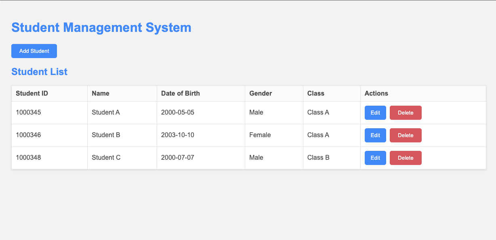

# Student Management System (v3) - Server Side Rendering (SSR)



## Introduction

This project is a web-based Student Management System developed using Node.js and Express.js, along with MySQL for database management. The system provides functionalities to manage student information, including adding, updating, viewing, and deleting student records. It also supports the management of classes and allows for viewing the list of students by class.

## Prerequisites

Before running this project, ensure you have the following installed:

- [Node.js](https://nodejs.org/en/download/)
- [MySQL](https://dev.mysql.com/downloads/mysql/)
- [Git](https://git-scm.com/downloads)

## Project Structure

Here is an overview of the main directories and files in the project:

- **/controllers**: Contains the logic for handling requests and returning responses.
- **/models**: Defines the database schema using Sequelize ORM.
- **/routes**: Contains route definitions for handling HTTP requests.
- **/views**: Contains the EJS templates for rendering HTML pages.
- **/config**: Holds configuration files for the database connection and environment variables.
- **/public**: Static files like CSS, JavaScript, and images.
- **app.js**: The main entry point of the application.
- **package.json**: Lists the project dependencies and scripts.

## Setup Instructions

1. **Clone the Repository**

```bash
git clone https://github.com/nghuuquyen/web-basic.git

cd web-basic/javascript-demo/student-management-v3
```

2. **Install Dependencies**

Install all required dependencies using npm:

```bash
npm install
```

3. **Database Setup**

- Ensure MySQL is running on your machine.
- Create a new database called `student_management`.
- Update the database configuration in environment variables (`.env` file).

Create `.env` like `.env.example` and set the values. For example:
```
PORT=3000
DATABASE_HOST=127.0.0.1
DATABASE_PORT=3306
DATABASE_USER=root
DATABASE_PASSWORD=password
DATABASE_NAME=student_management
```

4. **Run Database Migrations**

Run the migrations to set up the database schema:

```bash
npx sequelize-cli db:migrate
```

5. **Seed the Database**

Populate the database with initial data:

```bash
npx sequelize-cli db:seed:all
```

6. **Start the Server**

If you want to run the server in production mode, use:
```bash
npm start
```

If you want to run in development mode, use:
```bash
npm run dev
```

# Reset Database

To reset the database, you could run the following command to undo all migrations and re-run them.
```
npx sequelize-cli db:migrate:undo:all
npx sequelize-cli db:migrate
npx sequelize-cli db:seed:all
```

Or if you want to drop the entire database and create a new one.
```
npx sequelize-cli db:drop
npx sequelize-cli db:create
npx sequelize-cli db:migrate
npx sequelize-cli db:seed:all
```